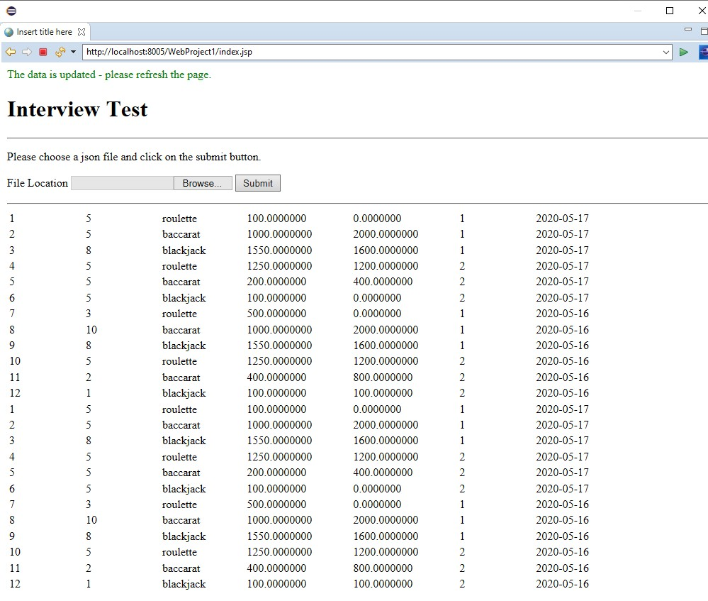

# java-json-to-mysql

#Overview: 

Create a Java Web Application that can insert data into a mysql database from a JSON file containing betting summary data. Create a page to search and filter the data presented using JSP, React or Angular if you prefer. 
You can use any Java Application Server you want to do this ie. GlassFish, Tomcat and Resin. 

 
#Steps Required: 

Install mySQL on your local machine and a Java app server of your choice. 
Create a database table to store the data from the JSON data. Please index fields you think will need indexing to optimise select queries if this table was to grow into the millions of records. 
Write either a .jsp or Java class to read the JSON file and insert it into the database table you created in the previous step. 
Write a page that allows you to search this table with filters based on the following fields; game,clientid,date. 

#Screen Image:

#The Procedure
I have done these points:

1. Added jsp file to display a form so a client can choose .json file from their computer
2. index.jsp  will select All the records from the table 'bets'  on the database 'interview'
3. When the form is submitted, the function loadJSON is called from Add to Bets
4. AddtoBets will load JSON file specified in the input
5. It picks up data from the JSON file into an object, and convert the object->bets into a JSONArray
6.  It iterates through the array and add the records into the 'bets' table

#Comments

1. I have dropped the primary key from the bets table as the data has the "id" and there might be a case duplicate id will be permissive.

